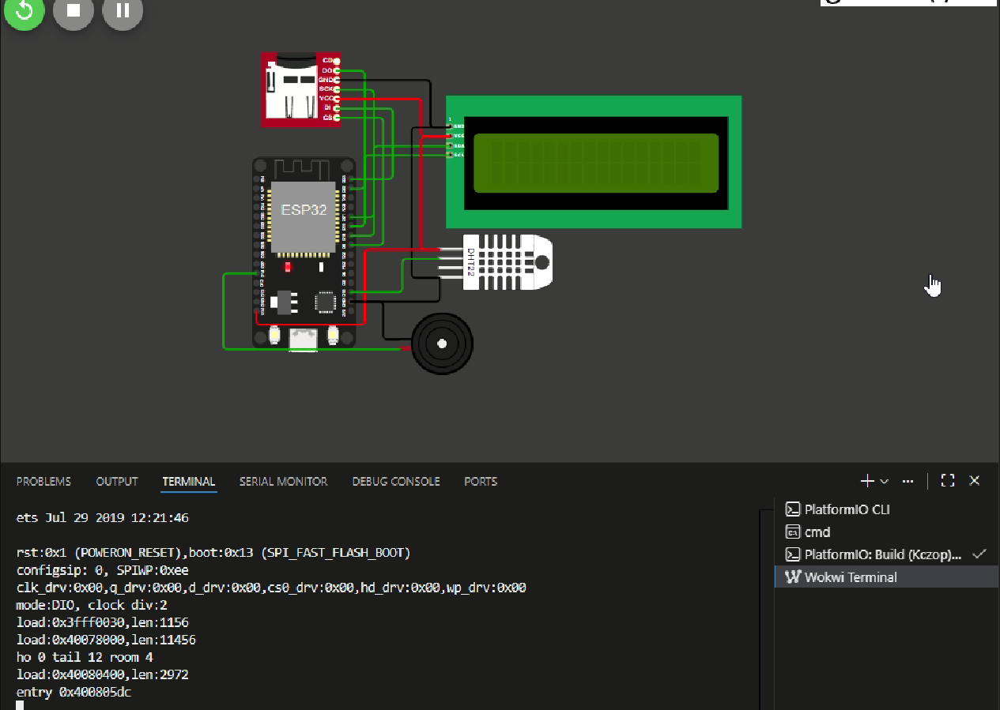

# ESP32 Firebase Datalogger

## Zawartosc repozytorium
- `Kczop/` - firmware PlatformIO (ESP32 + DHT22 + LCD I2C + microSD + buzzer).
- `Kczop/src/main.cpp` - logika odczytu, alarm buzzerem, zapis na SD i wysylka do Firebase.
- `Kczop/platformio.ini` - konfiguracja projektu i zaleznosci (LiquidCrystal_I2C_ESP32, DHT, Firebase ESP32 Client itp.).
- `Kczop/diagram.json` + `wokwi.toml` - polaczenia Wokwi: DHT22 data=GPIO15, LCD SDA=21/SCL=22, SD CS=5 MOSI=23 MISO=19 SCK=18, buzzer=14, zasilanie VIN/GND.
- `website/public/` - statyczna aplikacja www (Highcharts, canvas-gauges, jQuery, Firebase Web SDK).
- `website/firebase.json` / `database.rules.json` - konfiguracja i reguly RTDB (domyslnie możliwy odczyt/zapis).
- `sdk_tekst.txt` - szablon inicjalizacji Firebase SDK.

Demo online: https://kczop-551b1.web.app

## Sprzet
- ESP32 DevKit v1.
- DHT22 -> data GPIO15, VCC VIN, GND GND.
- LCD 16x2 I2C -> SDA 21, SCL 22, VCC VIN, GND.
- microSD (SPI) -> CS 5, MOSI 23, MISO 19, SCK 18, VCC VIN, GND.
- Buzzer aktywny -> plus GPIO14, minus GND.

## Firmware (Kczop/)
- Wi-Fi zdefiniowane w `main.cpp` (`WIFI_SSID`, `WIFI_PASSWORD`).
- Synchronizacja czasu NTP (pool.ntp.org, UTC+1) do stempli epoch.
- Odczyt DHT co 5 s; alarm buzzerem przy temp < 5 C lub > 45 C.
- Wyswietlanie na LCD 16x2.
- Zapis na karte SD do `/pomiary.txt` z naglowkiem csv.
- Wysylka do Firebase RTDB co 30 s na sciezke `/UsersData/public/readings` (temperatura, wilgotnosc, timestamp); biblioteka `Firebase ESP32 Client`.
- Konto Firebase (email/haslo) i klucz API sa jawne w `main.cpp`

### Budowanie i wgrywanie
1. Zainstaluj PlatformIO (CLI lub VS Code).
2. W `Kczop/src/main.cpp` ustaw Wi-Fi, dane RTDB i ewentualnie interwaly.
3. Zbuduj: `pio run -d Kczop`.
4. Wgraj na ESP32: `pio run -d Kczop -t upload`.
5. Monitor szeregowy: `pio device monitor -d Kczop`.
6. (Opcjonalnie) Symulacja Wokwi korzysta z `diagram.json`/`wokwi.toml` (firmware z `.pio/build/esp32dev/`).

## Aplikacja WWW (website/public)
- Pobiera dane z RTDB (`UsersData/public`) bez uwierzytelniania; konfiguracja Firebase w `script/index.js`.
- Widoki: karty ostatniego pomiaru, wskazniki (canvas-gauges), wykresy Highcharts z dynamicznym zakresem `charts/range`, tabela z lazy-load oraz przycisk usuwania danych.
- Domyslne reguly RTDB w `website/database.rules.json` pozwalają na odczyt/zapis.
- Hostowanie statyczne np. przez Firebase Hosting: `firebase deploy --only hosting` (z katalogu `website` po konfiguracji CLI) lub lokalne `firebase serve`.

## CI / GitHub Actions
- Workflow: `.github/workflows/pio-build.yml`.
- Wyzwalacze: `push` i `pull_request` na galezie `main`/`master`.
- Kroki: checkout, Python 3.11, cache `~/.platformio`, instalacja PlatformIO (`pip install platformio`), build `pio run -d Kczop`.

### Konfiguracja frontendu
1. Upewnij sie, ze reguly bazy pozwalaja na odczyt/zapis z ESP32 i aplikacji www.

## Dodatkowe uwagi
- Przykladowe dane uwierzytelniajace (Wi-Fi, Firebase, email/haslo) sa jawne - zamien je na prywatne przed publikacja.
- Plik `pomiary.txt` na karcie SD zapisuje temperature i wilgotnosc wraz z unifikowanym czasem (epoch z NTP lub czas od uruchomienia).
- Prezentacja dzialania: `mov/Example.mp4` (lokalny film pokazujacy kompletne uruchomienie ukladu i dashboardu).
